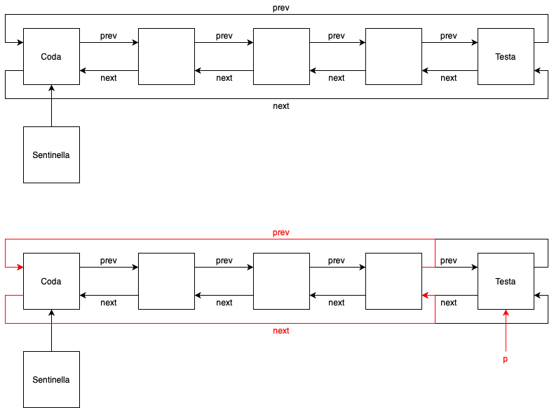
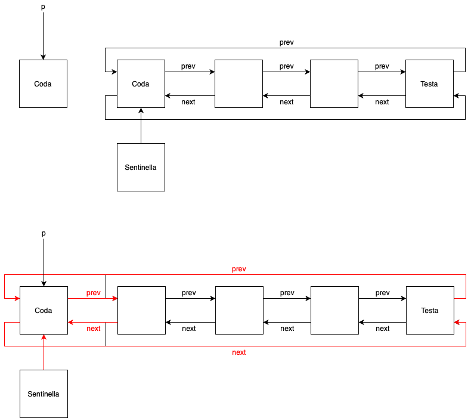

# PandOS
PandOS è un sistema operativo a scopo didattico.
Deve essere realizzato su architettura **uMPS3**, che può essere descritta con **6 livelli** di astrazione.

## Fase 1
La fase 1 di PandOS si occupa della **gestione code**.
Più in particolare si hanno le strutture dati **Process Control Block** e **Active Semaphore List** che hanno il compito di descrivere lo stato di un processo.
Lo scopo della fase 1 consiste nell'implementazione delle funzioni che gestiranno tali strutture dati, e sono implementati nei file `pcb.c` e `asl.c`.\
La lista dei processi sono generalmente liste con sentinella, bidirezionali e circolari, mentre la lista dei semafori è generalmente una lista con sentinella e monodirezionale.\
Vincoli:
- `pcbFree_h` è la lista dei PCB che sono liberi o inutilizzati;
- `pcbFree_table[MAX_PROC]`: array di PCB con dimensione massima di MAX_PROC.
- `semd_table[MAX_PROC]`: array di SEMD con dimensione massima di MAX_PROC.
- `semdFree_h`: Lista dei SEMD liberi o inutilizzati.
- `semd_h`: Lista dei semafori attivi (Active Semaphore List – ASL)

Caratteristiche delle liste:
- Tutte sentinelle puntano alla coda delle liste.
- Tutte le liste sono di tipo FIFO.
- **Solamente** le liste `pcbFree_h` e `semdFree_h` sono di tipo LIFO,  non sono circolari e hanno la sentinella che punta alla testa.
- Le liste di tipo FIFO inseriscono in testa e rimuovo in coda.
- Le liste di tipo LIFO inseriscono in testa e rimuovo in testa.  

I metodi principali sono la rimozione e l'inserimento dalla lista di un elemento.  
Nel caso in cui la lista sia di tipo **FIFO**, la rimozione e l'interimento comporta i seguenti comportamenti:

Nella rimozione bisogna modificare il puntatore *next* dell'elemento precedente all'elemento rimosso e il puntatore *prev* dell'elemento successore all'elemento rimosso.

Nell'inserimento bisogna modificare tutti i puntatori dell'elemento precedenete e successore all'elemento inserito.

Nel caso in cui la lista sia di tipo **LIFO**, ossia nelle liste dei processi e semafori liberi, la rimozione e l'inserimento comporta i seguenti comportamenti:

Nella rimozione bisogna modificare il puntatore *next* dell'elemento precedente all'elemento rimosso e il puntatore *prev* dell'elemento successore all'elemento rimosso.
Nel caso sia una rimozione in testa, come nell'immagine, si modifica la *sentinella* verso il suo successore e cancellare il puntatore *prev* della nuova sentinella (mettere a *NULL*).

Nell'inserimento bisogna modificare la *sentinella* verso il nuovo elemento e modificare i puntatori l'elemento della vecchia sentinella con quella nuova.

Nel caso dei semafori il puntatore *prev* non è presente, quindi durante la rimozione di un semaforo in una lista bisogna utilizzare un puntatore ausiliario che punta all'elemento predecessore; nell'implementazione tale puntatore è `pre`.

Il progetto è stato commentato interamente in lingua italiana.
